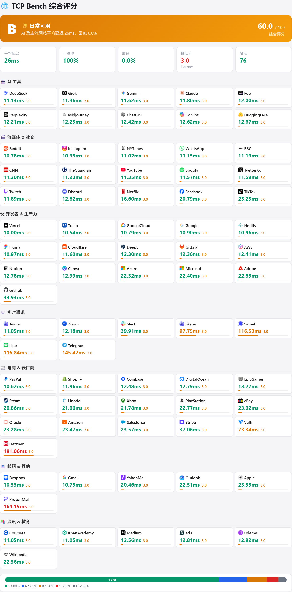
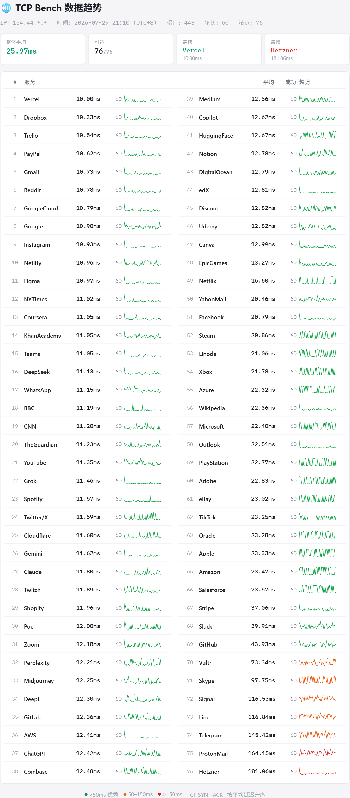

# TCP Bench

在你的 VPS 上跑一下访问全球主流网站的真实延迟，看看到底是什么水平。

## 功能亮点

-   对 **Google、GitHub、Netflix、Discord、ChatGPT** 等 **76 个**全球主流站点发起 TCP 连接，测出真实的握手延迟
-   报告页采用**左右双栏设计**：左侧卡片式综合评分 + 右侧折线趋势数据
-   **动态评分系统**：每个站点 5 分满分，基于该站点历史平均延迟打分（每月自动更新基准），整体等级 S/A/B/C/D
-   **导出图片**：一键生成 PNG，支持评分图和趋势图分开下载，CORS 代理直连保证 logo 完整
-   **IP 隐私保护**：提交前自动隐藏 IP 后两段（如 `192.168.*.*`），排行榜也显示掩码 IP
-   **排行榜**：主机名、测试 IP、平均延迟、可达率、时间一目了然

## 使用方法

一条命令即可在你的 VPS 上运行测试：

```bash
curl -sL https://tcpbench.com/run.sh | bash
```

跑完之后在终端你会看到一个报告链接，点开就是下面这样的的报告页。





## 测试范围

76 个网站覆盖 7 个场景：

-   **🤖 AI 工具**：ChatGPT、Claude、Gemini、Perplexity、Midjourney、Copilot、Grok、DeepSeek、HuggingFace、Poe
-   **🎬 流媒体 & 社交**：YouTube、Netflix、TikTok、Twitter/X、Reddit、Instagram、Facebook、WhatsApp、Discord、Spotify、Twitch、NYTimes 等
-   **🛠 开发者**：GitHub、Vercel、Cloudflare、Google、AWS、Azure、Notion、Figma 等
-   **💬 实时通讯**：Telegram、Discord、Zoom、Slack、Signal、Line、Skype、Teams
-   **🛒 电商 & 云厂商**：Amazon、eBay、PayPal、Stripe、Hetzner、DigitalOcean、Vultr 等
-   **📧 邮箱**：Gmail、Outlook、ProtonMail、YahooMail、Apple、Dropbox
-   **📚 资讯 & 教育**：Wikipedia、Medium、Udemy、Coursera、edX、KhanAcademy

总共 76 个网站，每个满分 5 分。评分基于该网站的**历史平均延迟**（排行榜统计）：比历史快得高分，比历史慢得低分。平均值每月 1 号自动更新，数据越多越准。

## 评分等级

| 等级 | 得分比例 | 标签 |
|:----:|:--------:|:-----|
| S | ≥80% | 🚀 极速冲浪节点 |
| A | ≥65% | 👍 优秀体验 |
| B | ≥50% | 👌 日常可用 |
| C | ≥35% | 🤔 将就使用 |
| D | <35% | 🐌 延迟偏高 |

## 隐私

-   测试脚本在本地执行，IP 后两段自动隐藏
-   不上传任何敏感信息
-   脚本源码完全公开，建议先看一眼再跑

## 自部署

如果你想把 tcpbench 部署到自己的服务器：

```bash
git clone https://github.com/se-tang/TCPbench.git
cd TCPbench/backend

# 配置 PostgreSQL + .env
cp .env.example .env
# 编辑 .env 填上你的 DATABASE_URL、SITE_URL 等

pip install -r requirements.txt
uvicorn main:app --host 0.0.0.0 --port 8000
```

## 技术栈

-   **后端**: FastAPI + SQLAlchemy + PostgreSQL
-   **前端**: Jinja2 模板 + CSS Grid/Column 布局 + html2canvas 导出
-   **测试脚本**: 纯 Bash (`/dev/tcp`)，零依赖
-   **favicon 代理**: 服务端缓存 + CORS 直连
